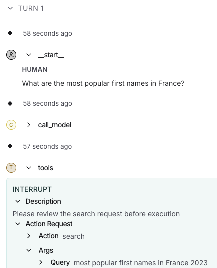
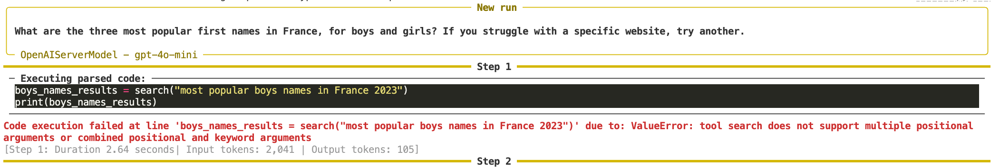
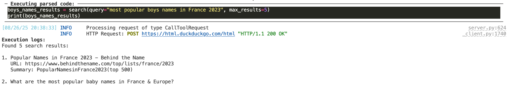
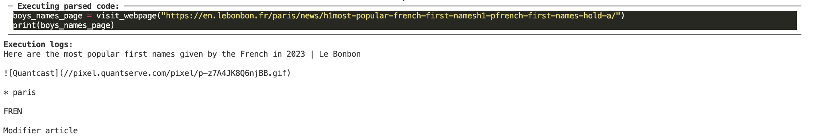
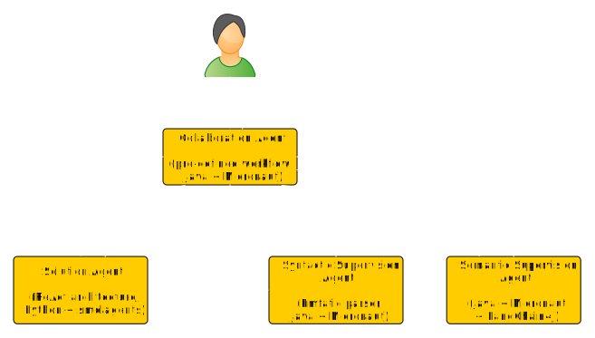

% From workflow-based to fully-agentic applications: smolagents and LangGraph
% Antonio Garcia-Dominguez
% LLMA4SE 2025 - September 2nd, 2025

# Introduction

## Who am I?

* Senior Lecturer in Software Engineering at the [Department of Computer Science](https://www.york.ac.uk/computer-science/) of the U. of York
* Researcher at the [Automated Software Engineering](https://www.york.ac.uk/computer-science/research/groups/automated-software-engineering/) research group
* Work package lead in the [MOSAICO EU project](https://mosaico-project.eu/)

## What is a Language Model?

* Statistical model which predicts the probability of the next token based on previous ones
* Uses mechanisms such as *attention* to focus on key parts of the text and improve its predictions
* Comes in a range of *parameter sizes*:
  * From small LMs that you can run locally, 
  * to large LMs that require server-class GPUs

## Standalone LM limitations

On its own, an LM:

* Can only rely on its own training set
* Can only produce an output:
  * Cannot judge its quality
  * Cannot perform tasks on your behalf
* Is limited by its *context window* on how much information it can consider at a time

## From LMs to agents

We will use the definition from [LangGraph](https://langchain-ai.github.io/langgraph/agents/overview/):

Agent = LM + tools + prompt

A *tool* is a piece of manually written code that an LM can invoke to retrieve information, or perform an action on our behalf.

## LM uses come in a spectrum

We will move between two extremes:

* Fixed workflow: predictable
* Flexible workflow: LM creates a plan

We will try both approaches in the workshop.<br/>
Let's see some workflow patterns first.

<sub><sup>(note: patterns by Anthropic, figures by LangGraph)</sup></sub>

## Prompt chaining


## Parallelisation


## Routing


## Orchestrator-Worker


## Generator-Evaluator


## The ReAct architecture

Yao et al. proposed it in [ICLR 2023](https://par.nsf.gov/biblio/10451467)


## Choosing within spectrum

* Preference between predictability and flexibility?
* Consider our LM's capabilities:
  * SLMs: may want more prescriptive workflows
  * LLMs may have sufficient inference power to drive fully-agentic workflows
* Berkeley hosts a [function calling leaderboard](https://gorilla.cs.berkeley.edu/leaderboard.html)

## Other common augmentations

* Extending prompt with info from elsewhere (retrieval augmented generation)
* Involving users in decisions (human-in-the-loop)
* Asking questions back (multi-turn conversations)
* Explicitly managing agent memories

# Workflows with LangGraph

## What is LangGraph?

* Python-based framework for LM-based workflows and agents, with rewinding and human-in-the-loop
* Core is open-source, with non-OSS extras:
  * Studio: web-based development environment
  * Platform: automated deployment of agents
* [https://www.langchain.com/langgraph](https://www.langchain.com/langgraph)

## LangGraph Platform

{width=80%}

## Core components

Every LG app is made up of:

* Current *state* of the application
* *Nodes* that update the state
* *Edges* that decide which node to run next

## Minimal example: state + nodes

```python
class State(TypedDict):
    user_name: str
    messages: list[str]

def hello(state: State) -> State:
    return { "messages": ["Hello {}!".format(state["user_name"])] }

def bye(state: State) -> State:
    return { "messages": ["Bye {}!".format(state["user_name"])] }
```

We create a state schema, and define two nodes.

## Minimal example: graph setup

```python
builder = StateGraph(State)
builder.add_node("hello", hello)
builder.add_node("bye", bye)
builder.add_edge(START, "hello")
builder.add_edge("hello", "bye")
builder.add_edge("bye", END)

graph = builder.compile()
```

We populate and compile the graph.

## Minimal example: execution

Now we run the graph:

```python
print(graph.invoke(State(user_name="Antonio")))
```

We get the final state:

```python
{'user_name': 'Antonio', 'messages': ['Bye Antonio!']}
```

Where did our "Hello" go?

## Reducers for state updates

* Nodes return changes to state fields
* new_state = reducer(old_state, change)

If we change the `messages` in `State` to:

```python
messages: Annotated[list[str], add]
```

Now our final state is:

```python
{'user_name': 'Antonio', 'messages': ['Hello Antonio!', 'Bye Antonio!']}
```

## Common case: MessagesState

* Given the LM focus, `messages` is so common that there is a predefined `MessagesState` with it
* In `MessagesState`, the default `add_messages` reducer allows for updating messages with same ID

## Conditional edges (I)

```python
class State(TypedDict):
    flip_result: bool
    messages: list[str]

def flip_coin(_: State) -> State:
    return { "flip_result": random() < 0.5 }

def flipped_heads(state: State) -> State:
    return { "messages": [ "You flipped heads!" ]}

def flipped_tails(state: State) -> State:
    return { "messages": [ "You flipped tails!" ]}
```

How to transition based on a state condition?

## Conditional edges (II)

```python
def use_flip_result(state: State) -> Literal["flipped_heads", "flipped_tails"]:
    return "flipped_heads" if state["flip_result"] else "flipped_tails"

builder = StateGraph(State)
# ... nodes ...
# ... other edges ...
builder.add_conditional_edges("flip_coin", use_flip_result)
```

We add a conditional edge for this.
The type annotations are useful for generating diagrams.

## Chatbot: adding an LM

Now we want to use GPT-4o-mini:

```python
llm = init_chat_model("gpt-4o-mini")
class State(MessagesState):
    pass

def call_model(state: State) -> Dict[str, Any]:
    return { "messages": llm.invoke(state["messages"]) }

graph = (StateGraph(State)
    .add_node(call_model)
    .add_edge(START, "call_model")
    .compile(name="Memory-less chatbot"))
```

What happens if we try to talk to it?

## Chatbot without memory

First interaction:

```text
== Human Message =================================
Hello, my name is Antonio!
== Ai Message ==================================
Hello, Antonio! How can I assist you today?
```

Second interaction:
```text
== Human Message =================================
Do you remember my name?
== Ai Message ==================================
I don’t have the ability to remember personal information or previous interactions. Each conversation is treated independently. How can I assist you today?
```

## Adding memory: thread IDs

* LG supports conversation *threads*
* We mention the thread ID during invocations

```python
result = graph.invoke(
    State(messages=[HumanMessage(content="...")]),
    config={"configurable": {"thread_id": thread_id}}
)
```

* Thread ID is up to us, but it's usually a UUID
* This is not enough, though: let's check

## Adding memory: checkpointers

A *checkpointer* persists thread-scoped state

```python
graph = (StateGraph(State)
    .add_node(call_model)
    .add_edge(START, "call_model")
    .compile(
        name="Chatbot with in-memory checkpointer",
        checkpointer=InMemorySaver()))
```

We set up a graph with memory-based checkpointing
(SQLite and Postgres can also be used with Server).

## Adding memory: result

First interaction with thread ID 1:

```text
H: Hello, my name is Antonio!
AI: Hello, Antonio! How can I assist you today?
```

Second interaction with thread ID 1:
```text
H: Hello, my name is Antonio!
AI: Hello, Antonio! How can I assist you today?
H: Do you remember my name?
AI: Yes, your name is Antonio! How can I help you today?
```

The messages from the original interaction were re-sent together with the second interaction.

## Managing history

* Overly long threads risk the LLM losing focus, and consume more tokens
* We could trim or summarise previous messages (e.g. using LM once history goes over a threshold)
* `add_messages` supports `RemoveMessage(id=N)` for deleting messages

## Tools: define

A tool can be just a decorated Python function:

```python
@tool
def multiply(left, right):
    """
    Multiplies the left operand by the right operand, and returns the result.
    """
    return left * right
```

## Tools: bind

We need to bind tools to the LM, so it is told about the available tools upon invocation:

```python
llm = init_chat_model("gpt-4o-mini")
tools = [multiply]
llm_with_tools = llm.bind_tools(tools)
```

## Tools: node and edges

```python
graph = (StateGraph(State)
    .add_node(call_model)
    .add_node("tools", ToolNode(tools))
    .add_edge(START, "call_model")
    .add_conditional_edges("call_model", tools_condition)
    .add_edge("tools", "call_model")
    .compile(...))
```

* Need node that executes tools requested by LM
* Need edge that decides when to visit that node
* LG has predefined implementations for those

## Tools: example run

```text
H: What is the result of 40 times 3?

AI:
  Tool Calls:
    multiply (call_eEamAVQRuhRXeeomX7wcyt90)
   Call ID: call_eEamAVQRuhRXeeomX7wcyt90
    Args:
      left: 40
      right: 3

Tool (multiply): 120
AI: The result of 40 times 3 is 120.
```

Since the agent has a checkpointer, we could ask for further multiplying the result over and over.

## Tools: MCP

Anthropic created the [Model Context Protocol](https://modelcontextprotocol.io/docs/getting-started/intro) to standardise integrating LMs with external services.

How about the DuckDuckGo search engine?

```python
client = MultiServerMCPClient({
  "ddg": {
    "command": "uvx",
    "args": ["duckduckgo-mcp-server"],
    "transport": "stdio"
  }
})
tools = await client.get_tools()
llm_with_tools = llm.bind_tools(tools)
```

## Trying out DuckDuckGo

Some example queries:

* What is the population of Madrid?
* What will be its population in 2050?
* What are the most popular first names in France?

Sometimes the search is not quite right...

## Human-in-the-loop scenarios

We need to involve users in decision-making:

* Approval of high-impact actions
* Correction of the graph state
* Clarification / extra input from the human

## Interrupting search requests

```python
@tool(...)
async def search_with_permission(config: RunnableConfig, **tool_input):
  request = HumanInterrupt(...)
  response = interrupt(request)
  if response["type"] == "accept":
    return await search_tool.ainvoke(tool_input, config)
  elif response["type"] == "response":
    return "The user interrupted the search request, and gave thifeedback:\n".format(response["args"])
  else:
    raise ValueError("Unknown response type {}".format(respon["type"])

tools = [search_with_permission, fetch_tool]
llm_with_tools = llm.bind_tools(tools)
```

Let's try this out.

## Interrupted search

{width=33%}

## Predefined agents (ReAct)

::: columns

::: column

{width=600px}

:::

::: column

`create_react_agent` can produce the graph on the left

* `pre_model_hook`: before LM (e.g. condense messages)
* `post_model_hook`: after LM (e.g. guardrails, interrupts)
* Can ask for structured response (if LM supports it)

:::

:::

## Reuse from other systems: LangGraph SDK

* LangGraph Server wraps a graph around an API
* LangGraph provides SDKs with clients for the API
* This allows for reusing an agent from a larger app (e.g. a web client, like Studio)
* Checkpointing can be replaced with Postgres + Redis for persistence across restarts

## Beyond this talk

* Time travel (replay from a previous point)
* Subgraphs (for reuse and encapsulation)
* Multi-agents (for specialisation)
* Long-term memories via a *store*

# Agentic applications in Smolagents

## What is Smolagents?

* Open-source agentic framework developed by HuggingFace (Apache 2.0 license)
* Entirely based on the ReAct loop (no explicit workflows): focus on tool + step callback writing
* Uses Python-based actions instead of JSON objects
  * Python runs in a limited environment
  * Can be further restricted (e.g. to run inside a VM)

## CodeAct (cited by Smolagents)

 mentioned up to 20% higher success rates](img/codeact.png)

## ReAct in SmolAgents

](img/Agent_ManimCE.gif){width=80%}

## Search: OpenAI + DDG MCP

```python
model = OpenAIServerModel(
    model_id="gpt-4o-mini",
    api_key=os.environ["OPENAI_API_KEY"]
)

server_parameters = StdioServerParameters(
    command='uvx',
    args=['duckduckgo-mcp-server']
)
```

We set up GPT-4o-mini and the DDG MCP server.

## Search with CodeAgent

```python
    mcp_client = MCPClient(server_parameters)
    tools = mcp_client.get_tools()
    agent = CodeAgent(
        tools=[tools[0], VisitWebpageTool()],
        model=model,
        max_steps=10
    )
    agent.run(
        "What are the three most popular first names in France, for boys and girls? "
        + "If you struggle with a specific website, try another.")
```

MCP search + Smolagents `visit_webpage`

(Smolagents had trouble with MCP `fetch_content`)

## Search: execution (I)



* First attempt runs into trouble: the tool function wants keyword arguments
* Issue in Smolagents' current MCP integration

## Search: execution (II)



Not ideal, though - you'll want your tool function to be more flexible, or provide clearer hints to use keyword arguments in prompt.

## Search: execution (III)



## Search: execution (IV)


## Tool metadata: visit_webpage

```python
class VisitWebpageTool(Tool):
    name = "visit_webpage"
    description = (
        "Visits a webpage at the given url and reads its content as a markdown string. Use this to browse webpages."
    )
    inputs = {
        "url": {
            "type": "string",
            "description": "The url of the webpage to visit.",
        }
    }
    output_type = "string"
```

We feed tool metadata (what it does, what it takes, and what it produces) to the LM.

## Tool feedback: visit_webpage

```python
class VisitWebpageTool(Tool):
    def forward(self, url: str) -> str:
        # ...
        try:
            response = requests.get(url, timeout=20)
            response.raise_for_status()  # Raise an exception for bad status codes
            # ...
            return self._truncate_content(markdown_content, self.max_output_length)
        except requests.exceptions.Timeout:
            return "The request timed out. Please try again later or check the URL."
        except RequestException as e:
            return f"Error fetching the webpage: {str(e)}"
        except Exception as e:
            return f"An unexpected error occurred: {str(e)}"
```

Good tools provide clear feedback to LLM

## Clarification from user in a tool

```python
class UserInputSearch(Tool):
    # ...
    def forward(self, query: str, max_results: int):
        updated_query = input(f"The agent is about to search '{query}'.\nIf this is OK, press Enter, otherwise type the changed query: ")
        if updated_query:
            query = updated_query
            print(f"Updated query to {query}")
        return self.base_search(query=query, max_results=max_results)
```

* We use a custom tool that calls `input`
* This only really works in a local, interactive setting!

## Docker executor

```python
with CodeAgent(
    # ...
    executor_type="docker",
    executor_kwargs={
        "build_new_image": False,
        "image_name": "jupyter-kernel-custom"
    }
) as agent:
  agent.run(...)
```

* Safer to run code on a sandbox like Docker
* Rough edges: MCP tools didn't work, needed custom `Dockerfile`

## Larger example: metamodelling

* [MOSAICO](https://mosaico-project.eu/): reliable SE with agent collaborations
* For WP1, we compared agent protocols



## Example prompt

```
Please generate a metamodel of a simple library management system with three main concepts: Library, Book, and Author.

Each Library has a name (String) and contains a collection of Books and a collection of Authors (both containment references). Each Book has a title (String) and a page count (int) and has a non-containment reference to its main Author. Each Author has a name (String) and age (int) and knows which Books they have written (non-containment reference to Books).

The system should clearly distinguish between containment and non-containment relationships: A Library owns its Books and its Authors (deleting the Library deletes its Books and its Authors). Authors and Books reference each other but do not manage each other's lifecycles.
```

## Issue: niche languages

* LMs can work well with popular languages (e.g. Python, Java),
  but not so well with niche domain-specific languages
* Usual options are:
  * Generate examples for fine-tuning (expensive)
  * Prompt engineering (e.g. few-shot)
* We decided to try Smolagents instead:
  * Tools to build an in-memory metamodel
  * Tool to use [Jinja](https://jinja.palletsprojects.com/en/stable/) to produce Emfatic

## Smolagents trace (I)

It decides on an overall plan:

```
Thought: I will start by defining the metamodel for the library management system. I will create a base class 'LibraryItem' that both 'Book' and 'Author' can inherit from. This will help in reducing duplication of attributes and references. Then, I will define the 'Library', 'Book', and 'Author' classes with their respective attributes and references.

1. Define the 'Model' package.
2. Define the 'LibraryItem' base class.
3. Define the 'Library' class with its attributes and containment references to 'Book' and 'Author'.
4. Define the 'Book' class with its attributes and non-containment reference to 'Author'.
5. Define the 'Author' class with its attributes and non-containment reference to 'Book'.

Let's proceed step by step.
```

## Smolagents trace (II)

It creates a Python program:

```python
# Step 1: Add the Model package
model_package_uri = add_package_declaration(package_name="Model", namespace_uri="http://example.com/library/model")

# Step 2: Define the LibraryItem base class
library_item_class = add_class(class_name="LibraryItem", namespace_uri=model_package_uri, base_class_name="")
add_attribute(namespace_uri=model_package_uri, class_name=library_item_class, attribute_name="name", attribute_type="String", attribute_cardinality="one")

# Step 3: Define the Library class with containment references to Book and Author
library_class = add_class(class_name="Library", namespace_uri=model_package_uri, base_class_name="LibraryItem")
add_containment_reference(namespace_uri=model_package_uri, class_name=library_class, reference_name="books", reference_type="Book", reference_cardinality="many")
add_containment_reference(namespace_uri=model_package_uri, class_name=library_class, reference_name="authors", reference_type="Author", reference_cardinality="many")

# Step 4: Define the Book class with a non-containment reference to Author
book_class = add_class(class_name="Book", namespace_uri=model_package_uri, base_class_name="LibraryItem")
add_attribute(namespace_uri=model_package_uri, class_name=book_class, attribute_name="pageCount", attribute_type="int", attribute_cardinality="one")
add_non_containment_reference(namespace_uri=model_package_uri, class_name=book_class, reference_name="author", reference_type="Author", reference_cardinality="one")

# Step 5: Define the Author class with a non-containment reference to Book
author_class = add_class(class_name="Author", namespace_uri=model_package_uri, base_class_name="LibraryItem")
add_attribute(namespace_uri=model_package_uri, class_name=author_class, attribute_name="age", attribute_type="int", attribute_cardinality="one")
add_non_containment_reference(namespace_uri=model_package_uri, class_name=author_class, reference_name="books", reference_type="Book", reference_cardinality="many")

# Generate the Emfatic code
emfatic_code = generate_emfatic()
print(emfatic_code)
```

## Smolagents trace (III)

It produces this (valid) Emfatic metamodel:

```emfatic
@namespace(uri="http://librarymanagement.com/1.0", prefix="p")
package LibraryManagementSystem;

class NamedElement {
  attr String name;
}
class Library extends NamedElement {
  val Book[*] books;
  val Author[*] authors;
}
class Book {
  attr String title;
  attr int pageCount;
  ref Author mainAuthor;
}
class Author extends NamedElement {
  attr int age;
  ref Book[*] booksWritten;
}
class Model {
  val Library[*] libraries;
}
```

## Caveats from experience

* Tool functions need to be LM-friendly:
  * Robust against sloppy usage
  * Good error messages to feed back to LM
* Trial-and-error to figure out typical mistakes
  from LM, reminiscent of those from novice programmers
* Significant token usage: best to use a local LM during
  experimentation (used Qwen2.5-coder:32B)
  * The [system prompt](https://github.com/huggingface/smolagents/blob/main/src/smolagents/prompts/code_agent.yaml) is already quite long

## Reuse: agent protocols

* Smolagents does not have a server of its own
* Reusing an agent requires a protocol
* One option: Google [A2A](https://github.com/a2aproject/A2A) (Agent-to-Agent) protocol
  * Mozilla.ai [any-agent](https://github.com/mozilla-ai/any-agent) can serve Smolagents via A2A
* As said before, MOSAICO compared protocols
  * In-house vs A2A vs MCP
  * A2A ticks most boxes, but not all of them!

## Smolagents vs LangGraph

* Pythonic tool-calling can be very powerful:
  * Can use loops, conditionals, expressions
  * Well-suited to SLMs (e.g. Qwen2.5-coder:32B)
* Smolagents is much simpler:
  * No persistence, and no server
  * Focused on interactive local use
* LangGraph is stronger at longer, persistent flows:
  * Explicit workflow definitions
  * State persistence via checkpoints
  * Long-term memories via [stores](https://langchain-ai.github.io/langgraph/concepts/memory/#collection)

# Conclusion

## What we covered

* We have introduced basic LM/agent definitions, workflow building blocks, and ReAct
* Discussed the LangGraph framework, which supports explicit workflows or ReAct loops
* Introduced the Smolagents framework, with its ReAct loop and Pythonic tool calling
* Showed an example where Smolagents can chain many tool calls in
  a single LM call, using a local LLM

## Thank you!

Materials available here:

[Github repository](https://github.com/agarciadom/llma4se-2025)

Contact me:

a.garcia-dominguez AT york.ac.uk

More about me:

[Personal website](https://www-users.york.ac.uk/~agd516/)