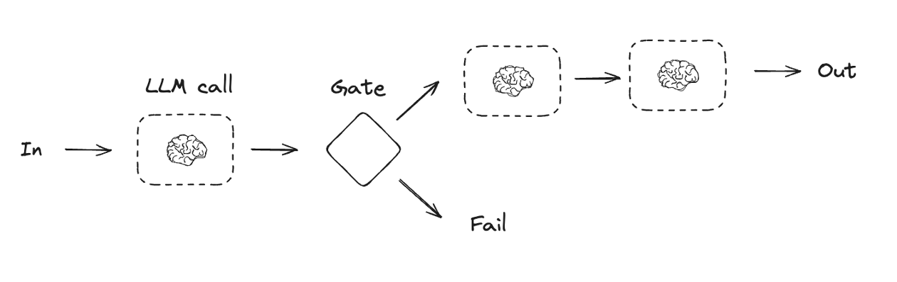
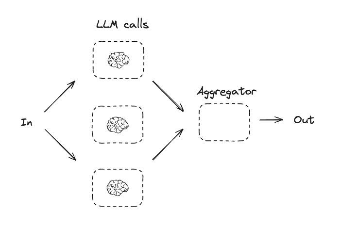
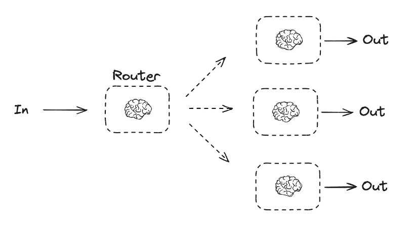
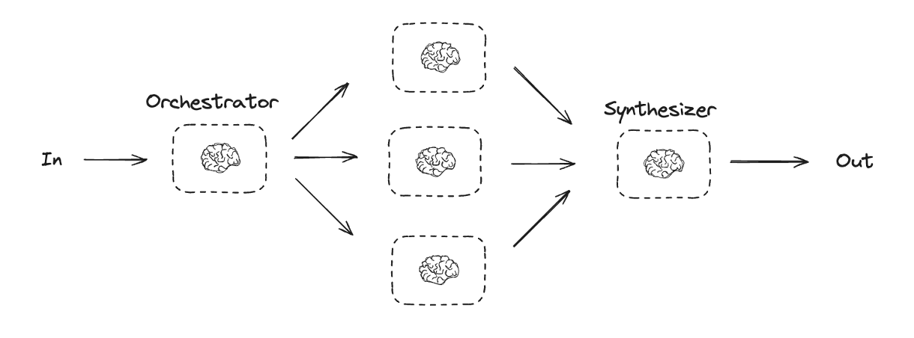
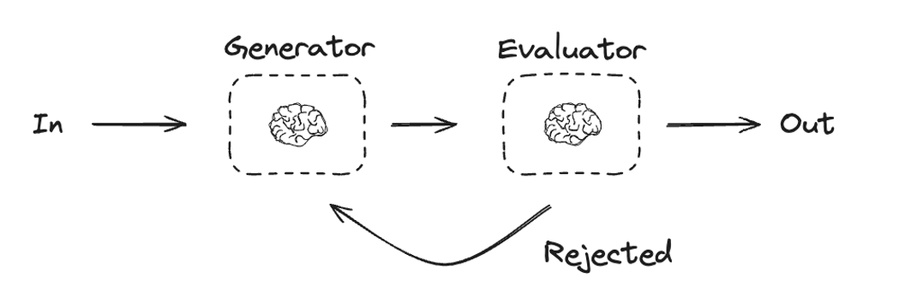
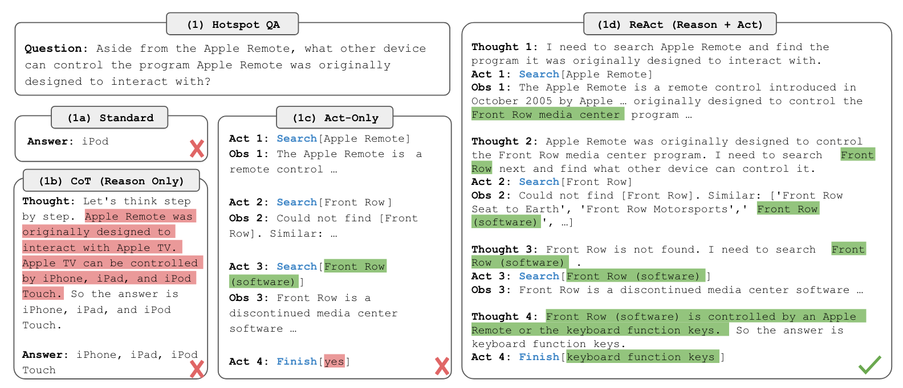

% From workflow-based to fully-agentic applications: smolagents and LangGraph
% Antonio Garcia-Dominguez
% LLMA4SE 2025 - September 2nd, 2025

# Introduction

## Who am I?

* Senior Lecturer in Software Engineering at the [Department of Computer Science](https://www.york.ac.uk/computer-science/) of the U. of York
* Researcher at the [Automated Software Engineering](https://www.york.ac.uk/computer-science/research/groups/automated-software-engineering/) research group
* Work package lead in the [MOSAICO EU project](https://mosaico-project.eu/)

## What is a Language Model?

* Statistical model which predicts the probability of the next token based on previous ones
* Uses mechanisms such as *attention* to focus on key parts of the text and improve its predictions
* Comes in a range of *parameter sizes*:
  * From small LMs that you can run locally, 
  * to large LMs that require server-class GPUs

## Standalone LM limitations

On its own, an LM:

* Can only rely on its own training set
* Can only produce an output:
  * Cannot judge its quality
  * Cannot perform tasks on your behalf
* Is limited by its *context window* on how much information it can consider at a time

## From LMs to agents

We will use the definition from [LangGraph](https://langchain-ai.github.io/langgraph/agents/overview/):

Agent = LM + tools + prompt

A *tool* is a piece of manually written code that an LM can invoke to retrieve information, or perform an action on our behalf.

## LM uses come in a spectrum

We will move between two extremes:

* Fixed workflow: predictable
* Flexible workflow: LM creates a plan

We will try both approaches in the workshop. 
Let's see some workflow patterns first.

(note: patterns by Anthropic, figures by LangGraph)

## Prompt chaining

## Parallelisation

## Routing

## Orchestrator-Worker

## Generator-Evaluator

## The ReAct architecture

Yao et al. proposed it in [ICLR 2023](https://par.nsf.gov/biblio/10451467)

## Choosing within spectrum

* Preference between predictability and flexibility?
* Consider our LM's capabilities:
  * SLMs: may want more prescriptive workflows
  * LLMs may have sufficient inference power to drive fully-agentic workflows
* Berkeley hosts a [function calling leaderboard](https://gorilla.cs.berkeley.edu/leaderboard.html)

## Other common augmentations

* Extending prompt with info from elsewhere (retrieval augmented generation)
* Involving users in decisions (human-in-the-loop)
* Asking questions back (multi-turn conversations)
* Explicitly managing agent memories

# Workflows with LangGraph

## What is LangGraph?

* Python-based framework for LM-based workflows and agents
* Core is open-source, with non-OSS extras:
  * Studio: web-based development environment
  * Platform: automated deployment of agents
* Handles state changes and persistence
* [https://www.langchain.com/langgraph](https://www.langchain.com/langgraph)

## LangGraph Platform

{width=80%}

## Core components

Every LG app is made up of:

* Current *state* of the application
* *Nodes* that update the state
* *Edges* that decide which node to run next

## Minimal example: Hello X!

(example which takes a name and tries to say Hello and Bye)

## Reducers for state updates

(improve the previous example by using the `add` reducer)

## Conditional edges

(change to a coin-flipping example with coin flip node + diff nodes on head/tails)

## Chatbot: adding an LM

(change to a simple chatbot example, using OpenAI + GPT-4o-mini)

## Adding memory

(add checkpointer + show example where LM has to recall something we said)

## Adding tools

(add tool for searching the web with DuckDuckGo MCP server, asking the population of Madrid and then a follow-up question)

## Human-in-the-loop

(add tool for asking the user for confirmation, e.g. before actually "buying" something)

## Predefined agents (ReAct)

::: columns

::: column

{width=600px}

:::

::: column

`create_react_agent` can produce the graph on the left

* `pre_model_hook`: before LM (e.g. condense messages)
* `post_model_hook`: after LM (e.g. guardrails, interrupts)
* Can ask for structured response (if LM supports it)

:::

:::

## Reuse from other systems: LangGraph SDK

* LangGraph Server wraps a graph around an API
* LangGraph provides SDKs with clients for the API
* This allows for reusing an agent from a larger app (e.g. a web client)
* Checkpointing can be replaced with Postgres + Redis for persistence across restarts

# Agentic applications in Smolagents

## What is Smolagents?

* Open-source agentic framework developed by HuggingFace (Apache 2.0 license)
* Entirely based on the ReAct loop (no explicit workflows): focus on tool + step callback writing
* Uses Python-based actions instead of JSON objects
  * Python runs in a limited environment
  * Can be further restricted (e.g. to run inside a VM)

## CodeAct (cited by Smolagents)

 mentioned up to 20% higher success rates](img/codeact.png)

## ReAct in SmolAgents

](img/Agent_ManimCE.gif){width=80%}

## Minimal example: DB agent

(try managing a MariaDB database using MCP)

## Error reporting from tool calls

(what happens if the SQL is wrong?)

## Callbacks for human-in-the-loop

(ask human for confirmation when inserting a row)

## Reuse: agent protocols

* Smolagents does not have a server of its own
* Reusing an agent requires a protocol
* One option: Google [A2A](https://github.com/a2aproject/A2A) (Agent-to-Agent) protocol
  * Mozilla.ai [any-agent](https://github.com/mozilla-ai/any-agent) can serve Smolagents via A2A
* Quick plug: MOSAICO is looking at agent protocols
  * In-house vs A2A vs MCP
  * A2A ticks most boxes, but not all of them!

# Conclusion

## What we covered

* We have introduced basic LM/agent definitions, workflow building blocks, and ReAct
* Discussed the LangGraph framework, which supports explicit workflows or ReAct loops
* Introduced the Smolagents framework, with its ReAct loop and Pythonic tool calling

## Thank you!

Materials available here:

[Github repository](url to materials)

Contact me:

a.garcia-dominguez AT york.ac.uk

More about me:

[Personal website](https://www-users.york.ac.uk/~agd516/)