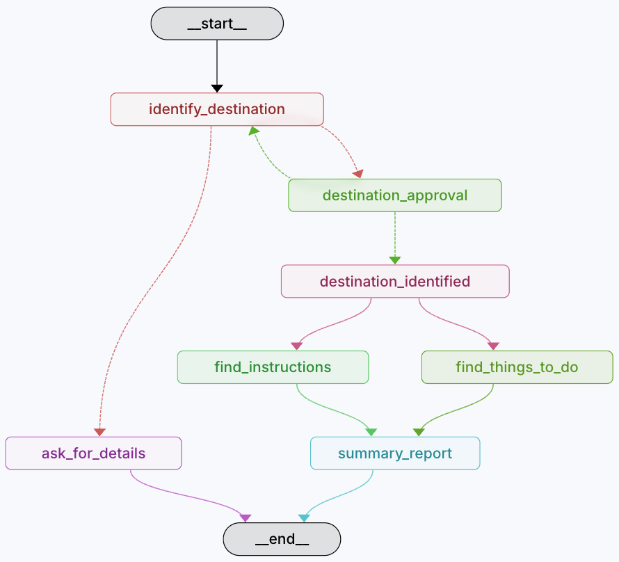

% Workshop: Development of agentic applications with human-in-the-loop via LangGraph
% Antonio Garcia-Dominguez
% LLMA4SE 2025 - September 2nd, 2025

# Preparation

## Software requirements

* [Git](https://git-scm.com/) client for cloning the repo with the materials
* A recent version of Python 3 (v3.10 or newer)
* [uv](https://github.com/astral-sh/uv) Python dependency manager
  * Install using the website's [instructions](https://docs.astral.sh/uv/getting-started/installation/)

## Third-party systems

* We need an OpenAI API key
  * For GPT-4o-mini access
  * To be provided by organizers
* We need a [LangSmith](https://eu.smith.langchain.com/) API key
  * For observability of LM calls
  * Sign up needed (free tier is OK for this workshop)
* We need a [Tavily](https://www.tavily.com/) API key
  * For web search
  * Sign up also needed (1000 queries/month for free)

## LangSmith: signing up

{width=50%}

## LangSmith: creating API key

::: columns

::: column


:::

::: column

* Go to Settings - API Keys
* Create a Personal Access Token (e.g. 30d expiry)
* Save the API key to a safe place for now

:::
:::

## Tavily: signup

* We will use Tavily API for web search
* Sign up to [tavily.com](https://www.tavily.com/)


## Cloning the workshop materials

Clone [this Git repository](https://github.com/agarciadom/llma4se-2025) with the materials:

```bash
git clone https://github.com/agarciadom/llma4se-2025.git
```

## Plan for the workshop

::: columns

::: column



:::

::: column

Starting from an empty project, we will:

* Create a prebuilt agent based on the ReAct loop
* Create a workflow-driven travel planner agent (see left)

:::

:::

# Search-enabled ReAct agent: familiarisation with Studio

## What you will do

* Understand the structure of a LangGraph project
* Use the ReAct prebuilt agent to test your setup
* Learn the basic use of the LangGraph Studio

## Development environment

* Open `workshop/exercises` in your IDE:
  * [VS Code](https://code.visualstudio.com/) works but not helpful with imports
  * [PyCharm](https://www.jetbrains.com/pycharm/) works but requires marking `src` as source root, by right-clicking on it and using "Mark Directory As"
* From a terminal inside `workshop/exercises`, download the dependencies with:

```bash
uv sync
```

## Entrypoint: langgraph.json

Open the `langgraph.json` file:

```json
{
  "dependencies": ["."],
  "graphs": {
    "prebuilt_searcher": "./src/prebuilt_searcher/graph.py:graph",
    "travel_planner": "./src/travel_planner/graph.py:graph"
  },
  "env": ".env",
  "image_distro": "wolfi"
}
```

`graphs` lists the agents in this project.<br/>
You do not need to change it.

## Environment variables: .env

* We need to provide our API keys to the agents
* Copy `.env.example` to `.env`
* Customise `.env` with your API keys
  * OpenAI, LangSmith, and Tavily
* Note: in CI environments, we would use secrets rather than `.env`

## Writing the prebuilt_searcher

Edit `src/prebuilt_searcher/graph.py`:

* Create a chat model with `init_chat_model`
  * Facade across all LangChain model providers
  * For example, pass `openai:gpt-4o-mini`
* Set `tools` to a list containing `TavilySearch()`
  * Default settings are fine, but can be customised
* Use `create_react_agent` to produce the graph, providing `model` and `tools`
  * Use keyword arguments, e.g. `model=...`

## Starting the prebuilt_searcher

::: columns

::: column

Use a terminal to run LangGraph Studio:

```bash
uv run langgraph dev
```

Select the `prebuilt_searcher` at the top.
You should see the graph on the right.

:::

::: column

{width=1200px}

:::

:::

## Testing the prebuilt_searcher

{width=80%}

* Studio allows inputs according to an *input schema*
* For a ReAct prebuilt, it is `MessagesState`
* Add a "Human" message and press "Submit", e.g.
  "What is the tallest mountain in Peninsular Spain?"

## ReAct may not use tools

{width=70%}

* In ReAct, it's up to the LM to decide
* If we really want it a source, we should say so!
* Add "Please cite your source" message and Submit

## ReAct decides it needs to search

::: columns

::: column


:::

::: columns

* We asked for a citation, so it performs a search
* Response includes links
* Note the "turn 2": it's the same thread so
  full chat history is sent.
* Try creating a new thread and asking in one
  go for info + citations.
:::

:::

## The "Trace" tab

::: columns

::: column

* Click on the "Trace" tab
* You can see every step of the graph for a turn
* You can inspect LM and tool calls
* You can check how many tokens were used and how much it cost

:::

::: column


:::

:::

## Other things to try

* Try hovering over a step and using "View state"
* You can also re-run a graph from a given point
  * This will create a fork
* You can edit the state at a given point and re-run with that changed state
* You can click on a node and toggle an interrupt before or after
  * Equivalent to a debugging breakpoint

# Travel planner: obtaining trip details

## What we will do

* Suppose you want something more controlled:
  an agent that helps someone plan a trip
* You do not want your users to ask anything they want:
  they should only provide the travel details and then
  sit back
* The first step is to obtain this info:
  * Departure city and country
  * Destintion city and country
* We will use *structured outputs* for this

# Travel planner: methods of transport

## What we will do

* We have departure and destination locations
* We can now use our own prompt to find out how to
  travel between these
* We can then share this information with the user
* We will use a *subgraph* for this

# Travel planner: what to see

## What we will do

* We would also like to suggest things to do at the destination
* To save time, we will run this prompt concurrently with the other one
* We will take advantage of the *super-step* concept in LG graphs

# Travel planner: human-in-the-loop

## What we will do

* Before we run the prompts, we may want to confirm with
  the user if we got the departure and destination locations right
* We will use *interrupts* for this

# Conclusion

## What we covered

* Built a simple ReAct-based agent with a search tool
* Built a workflow-based agent dedicated to travel planning, using:
  * Structured outputs
  * Subgraphs with ReAct loops
  * Concurrency within super-steps
  * Human-in-the-loop with interrupts

## Thank you!

Contact me:

a.garcia-dominguez AT york.ac.uk
